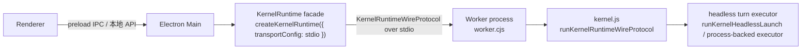

# 桌面端新内核 Worker 接入执行文档

## 1. 结论

桌面端下一步不再把旧 SDK、旧 `session.stream()`、每 turn CLI spawn 或
`stream-json` 兼容投影作为主接入路径。

注意：legacy SDK message / `stream-json` adapter 仍可作为 CLI、pipe、remote、
ACP 或 worker 内部 executor 的兼容投影存在；桌面端不能再把它当作
Electron Main 的事实协议或绕过 kernel runtime 的执行入口。

目标架构固定为：



关键边界：

- Electron Main 只做 host 调度、provider 选择、语义事件映射、生命周期管理。
- Worker 是常驻 kernel runtime 进程，不随单个 turn 退出。
- Worker 内部只 import `kernel.js`，启动 `runKernelRuntimeWireProtocol()`。
- turn 执行由 `KernelRuntimeWireProtocol` 的 `runTurnExecutor` / `headlessExecutor`
  承接；第一版桌面 worker 应按 `headless-embed-kernel-interfaces.md` 中的
  process-backed headless executor 路径接入，不能依赖不存在的桌面私有 executor。
- Main 和 Worker 之间只走 `KernelRuntimeWireProtocol`，不定义桌面私有 runtime 协议。
- 所有 provider/model/auth 选择必须随 conversation 或 turn 进入 kernel contract，不能依赖 Worker spawn env 作为唯一 provider 来源。

## 2. 当前基线

本执行文档以 `claude-code` commit `c616f07 feat(kernel): 收口桌面内核接入能力` 为前置基线。

截至 2026 年 5 月 1 日，当前工作区中的 `claude-code` 已将 desktop / worker
所需接口统一落在 `docs/headless-embed-kernel-interfaces.md` 定义的 public
kernel contract 上：package-level `kernel.js` 已暴露 `runKernelHeadlessLaunch()`、
`createKernelRuntime()`、`runKernelRuntimeWireProtocol()`、stdio/in-process
wire transport、`KernelRuntimeWireProtocolOptions.headlessExecutor` 与
process-backed headless executor 环境开关。

这里要特别纠偏：当前 public contract 不包含
`createKernelRuntimeInProcessTurnExecutor()`。桌面 worker 不能继续按这个旧函数名
写执行路径；应改为只 import package-level `kernel.js`，启动
`runKernelRuntimeWireProtocol()`，并通过 `headlessExecutor` 选项或
`HARE_KERNEL_RUNTIME_HEADLESS_EXECUTOR=process` 接入正式 headless executor。

另一个已确认的打包面要求是：同步 vendor `kernel.js` 时，还要同步它的 runtime
package dependencies 到 `electron/vendor/hare-code-kernel/node_modules`，否则
Node / Electron Main 在 release / vendor 路径下无法稳定 import `kernel.js`。

### 2.1 状态快照

- 已完成前置：
  - `claude-code` 已补齐 provider override contract。
  - `claude-code` 已补齐正式 kernel public headless launch/executor 入口。
  - `claude-code` 已补齐 `runKernelRuntimeWireProtocol()`、stdio/in-process
    transport、process-backed headless executor 与 package-only worker smoke。
  - `hare-code-desktop` 已新增 `electron/worker.cjs`。
  - `hare-code-desktop/electron/main.cjs` 已切到 stdio `KernelRuntime` singleton。
  - `/api/chat` 已统一收口到 `kernelConversation.runTurn()`。
  - 旧 `runViaOpenAI()` 与桌面侧 CLI args/env helper 已删除。
  - `scripts/sync-hare-sdk.cjs` 已同步 vendor `dist`，并补齐 vendor runtime `node_modules`（当前实测至少包含 `ws`）。
  - `electron/worker.cjs` 已从旧的 `createKernelRuntimeInProcessTurnExecutor()`
    假设切到 `runKernelRuntimeWireProtocol({ headlessExecutor })`。
  - `claude-code` process-backed headless executor 已能按 turn materialize
    `providerSelection` / desktop secret 到子进程 env，并把本地 attachment path
    refs 写入 headless stdin。
  - `claude-code` process-backed headless executor 已在每个带
    `providerSelection` 的 turn 前清理继承环境中的旧 provider flag/model/base/key，
    再注入本 turn 的 provider env，避免宿主旧 env 污染桌面 provider 切换。
  - `claude-code` process-backed headless executor 默认 headless CLI 参数已包含
    `--include-partial-messages`，确保 OpenAI-compatible / Anthropic 流式
    `stream_event` chunk 能稳定投影到 `turn.output_delta`；`headless.sdk_message`
    只保留给兼容消费者，已不再作为桌面主流程协议。
  - `hare-code-desktop/electron/main.cjs` 已把 `desktopProviderSecret` 收窄到
    per-turn metadata，不再写入 conversation metadata / snapshot。
  - `hare-code-desktop/electron/main.cjs` 已在 packaged 场景把 kernel / worker
    path 解析到 `app.asar.unpacked`，并默认用 Electron-as-Node 跑 worker，
    不再默认依赖系统 `bun`。
  - `package.json` 已把 `electron/worker.cjs`、vendor kernel `dist` 与 vendor
    runtime `node_modules` 放进 release 产物可被外部 worker 读取的位置。
  - 2026 年 5 月 1 日已补跑 Worker smoke、Desktop build、mac dir packaging、
    完整 mac DMG/ZIP packaging、packaged API smoke 与 packaged UI real-provider
    smoke，确认当前 worker/vendor/kernel contract 可执行。
  - `hare-code-desktop/electron/main.cjs` 已修复新桌面 conversation 预写随机
    `backend_session_id` 的问题；新会话不再把本地随机 UUID 传给 headless
    `--resume`，只在 kernel/headless 返回真实 `session_id` 后持久化。
  - `hare-code-desktop/electron/main.cjs` 已对不存在的 workspace 做运行时
    fallback；历史 state 中的坏路径不会继续作为 headless child `cwd`。
  - `claude-code` process-backed headless executor 已捕获 child spawn/stdin error；
    即使 cwd 或 command 不可用，也只返回 `turn.failed`，不会再让 worker 崩溃并
    把桌面端卡成 `Kernel runtime stdio transport is closed`。
- 仍待完成：
  - 仍需做真实桌面窗口手测，覆盖 stop-generation、reconnect、delete 与不同
    provider 切换；OpenAI-compatible 真实 provider 的 packaged UI 多轮 turn 已通过。
  - 如发布 notarized 产物或 Windows/Linux 产物，仍需跑对应 release target；
    本轮已覆盖 mac `.app`、DMG 与 ZIP 产物，但未做 notarization。

已经具备的 kernel contract：

- `RuntimeProviderSelection`
- `KernelRuntimeCapabilityIntent.provider`
- `create_conversation.provider`
- `run_turn.providerOverride`
- `KernelRuntimeWireTurnExecutionContext.providerSelection`
- `KernelRuntimeWireProtocolOptions.headlessExecutor`
- `HARE_KERNEL_RUNTIME_HEADLESS_EXECUTOR=process`
- provider 解析顺序：`providerOverride > conversation provider > runtime default`

当前剩余工作：

- 手动 `compact` 目前仍受 kernel session-context command blocker 限制。桌面端
  现已改为显式返回 `409 kernel_compact_session_context_unavailable`，不再假成功。
- 补跑真实桌面窗口手测，确认 stop / reconnect / delete 在界面上的行为。
- 补跑不同 provider / model 切换，确认 `providerOverride` 不污染其他
  conversation。
- 如果要发 notarized 或非 mac 产物，跑对应 release target；当前已验证 mac
  `.app`、DMG、ZIP 产物结构和 packaged API / UI path。

## 3. 非目标

本阶段不做这些事：

- 不保留 `createHeadlessChatSession()` / `session.stream()` 旧 SDK 兼容层。
- 不再使用 `resolveCoworkCliEntry()`、`buildCoworkCliArgs()`、`buildCoworkCliEnv()`。
- Electron Main 不在每个 turn 上 spawn `cli-bun.js`；如使用 process-backed
  headless executor，它必须被 Worker / kernel runtime 持有并受
  `KernelRuntimeWireProtocol` 生命周期约束。
- 不把 OpenAI-compatible 请求绕过 kernel 继续走 `runViaOpenAI()`。
- 不新增桌面端私有 wire schema。
- 不把 provider 切换写进 Worker 进程 env 并作为唯一来源。
- 不让 Renderer 直接知道 kernel wire protocol。

## 4. 进程与对象模型

### 4.1 Worker 粒度

第一版使用一个常驻 Worker 承载一个 `KernelRuntime`。

这个 Worker 可以管理多个 conversation；conversation 隔离由 `KernelRuntime`
内部负责。不要让 Electron Main 回到“每 turn 一个 CLI 子进程”的调度模式；
需要进程隔离时，应使用 Worker / kernel runtime 内部的 process-backed
headless executor。

如果后续发现某些 headless 全局状态仍不能被 runtime 隔离，再按 workspace 或 conversation 拆 Worker；这属于后续隔离策略，不改变 Main/Worker 的协议。

### 4.2 Electron Main 职责

Electron Main 保留现有 HTTP API 和 SSE 输出形态：

- `POST /api/chat`
- `POST /api/conversations/:id/stop-generation`
- `GET /api/conversations/:id/stream-status`
- `GET /api/conversations/:id/reconnect`
- `DELETE /api/conversations/:id`

Main 内部新增两个概念：

- `kernelRuntime`: 通过 `createKernelRuntime({ transportConfig })` 创建的 runtime facade。
- `activeRuns`: 只保留当前 turn 的 SSE buffer、emitter、stop handle、fullText，不再保存旧 SDK session。

### 4.3 Worker 职责

Worker 文件建议为：

- `electron/worker.cjs`

Worker 只做三件事：

1. resolve 并 import `kernel.js`。
2. 按当前 public contract 准备 `headlessExecutor` / process-backed executor 配置。
3. 启动 `runKernelRuntimeWireProtocol()`。

示意代码：

```js
const { pathToFileURL } = require('url');

const kernelEntry = process.env.HARE_DESKTOP_KERNEL_ENTRY;
if (!kernelEntry) {
  throw new Error('HARE_DESKTOP_KERNEL_ENTRY is required');
}

(async () => {
  const kernel = await import(pathToFileURL(kernelEntry).href);
  await kernel.runKernelRuntimeWireProtocol({
    eventJournalPath: false,
    conversationJournalPath: false,
    headlessExecutor: {
      command: process.env.HARE_KERNEL_RUNTIME_HEADLESS_COMMAND,
      args: process.env.HARE_KERNEL_RUNTIME_HEADLESS_ARGS_JSON
        ? JSON.parse(process.env.HARE_KERNEL_RUNTIME_HEADLESS_ARGS_JSON)
        : undefined,
    },
  });
})().catch(error => {
  console.error(error?.stack || error?.message || String(error));
  process.exit(1);
});
```

如果不显式传 `headlessExecutor`，也可以由 `claude-code` runner 读取
`HARE_KERNEL_RUNTIME_HEADLESS_EXECUTOR=process`、
`HARE_KERNEL_RUNTIME_HEADLESS_COMMAND`、
`HARE_KERNEL_RUNTIME_HEADLESS_ARGS_JSON`。两种方式都属于当前 public contract。

注意：`eventJournalPath: false` 和 `conversationJournalPath: false` 是桌面本地
first-pass 默认值，避免 provider/auth 相关 metadata 被误写入持久 journal。
后续如果要开 journal，必须先确认 provider secret 不会进入 snapshot/event
payload。

## 5. Provider Contract

桌面端是多 provider，不允许只靠 Worker 进程 env。

桌面 provider state 必须在每次创建 conversation 或运行 turn 时映射成 `RuntimeProviderSelection`：

```ts
type RuntimeProviderSelection = {
  providerId: string
  kind?: 'anthropic' | 'bedrock' | 'vertex' | 'foundry' | 'openai-compatible' | 'custom'
  model?: string
  baseURL?: string
  authRef?: string | {
    type: 'env' | 'secret' | 'desktop' | 'keychain'
    id?: string
    name?: string
    service?: string
    account?: string
  }
  headers?: Record<string, string>
  secretHeadersRef?: string | {
    type: 'env' | 'secret' | 'desktop'
    id?: string
    name?: string
  }
  options?: Record<string, unknown>
  metadata?: Record<string, unknown>
}
```

桌面映射规则：

```js
function toRuntimeProviderSelection(provider, modelId) {
  const format = provider?.format || inferFormat(provider?.baseUrl, modelId);
  return {
    providerId: provider.id,
    kind: format === 'openai' ? 'openai-compatible' : 'anthropic',
    model: modelId || provider.model,
    baseURL: provider.baseUrl || undefined,
    authRef: { type: 'desktop', id: provider.id },
    metadata: {
      desktopProviderName: provider.name || provider.id,
      desktopFormat: format,
      supportsWebSearch: Boolean(provider.supportsWebSearch),
      webSearchStrategy: provider.webSearchStrategy || null,
    },
  };
}
```

执行策略：

- 第一次 lazy create conversation 时传 `provider`。
- 每次 `runTurn()` 时也传 `providerOverride`，确保用户切换 model/provider 后当前 turn 使用最新选择。
- `init_runtime.defaultProvider` 只作为兜底，不作为桌面多 provider 的主路径。
- 不把 provider 切换写成 `OPENAI_COMPAT_*` / `ANTHROPIC_*` Worker 全局 env。

Auth 处理规则：

- `authRef` 默认用 `{ type: 'desktop', id: provider.id }`，表示这是 desktop provider secret。
- Worker/headless executor 必须通过 kernel provider resolver 消费 `authRef`，不要把 raw apiKey 写进 conversation snapshot。
- 如果短期必须把 secret 传给 Worker，只能作为本地临时 secret channel，并且必须关闭 journal、禁止进入 ack/event payload、禁止写 debug log。
- 最终状态应由 kernel 消费 `RuntimeProviderSelection`，在 provider resolver 内按 `authRef` 取真实凭证。

## 6. Electron Main 改造步骤

### Step 1: 删除旧执行路径

从 `electron/main.cjs` 移除或停止使用：

- `resolveCoworkCliEntry()`
- `buildCoworkCliArgs()`
- `buildCoworkCliEnv()`
- `runViaOpenAI()`
- Main 侧旧 `runViaKernel()` 内直接 spawn `bun .../cli-bun.js` 的
  ad-hoc executor path

保留：

- `resolveKernelModuleEntry()`
- `loadHareKernelModule()`
- provider CRUD
- conversation CRUD
- upload/context/project API
- SSE buffer/reconnect API

### Step 2: 新增 runtime singleton

Electron Main 增加：

```js
let kernelRuntimePromise = null;

async function getKernelRuntime() {
  if (kernelRuntimePromise) return kernelRuntimePromise;
  kernelRuntimePromise = (async () => {
    const kernel = await loadHareKernelModule();
    return kernel.createKernelRuntime({
      transportConfig: {
        kind: 'stdio',
        command: process.env.BUN_BINARY || 'bun',
        args: [path.join(__dirname, 'worker.cjs')],
        env: {
          ...process.env,
          HARE_DESKTOP_KERNEL_ENTRY: resolveKernelModuleEntry(),
        },
      },
      autoStart: true,
    });
  })();
  return kernelRuntimePromise;
}
```

Main 可以 import `kernel.js` 来创建 facade/client；Main 不能在自己进程内执行 headless turn。

### Step 3: 新增 conversation facade registry

Main 需要缓存 runtime conversation facade：

```js
const kernelConversations = new Map();

async function getKernelConversation(conversation, providerSelection) {
  const existing = kernelConversations.get(conversation.id);
  if (existing) return existing;

  const runtime = await getKernelRuntime();
  const kernelConversation = await runtime.createConversation({
    id: conversation.id,
    workspacePath: conversation.workspace_path || currentWorkspace,
    sessionId: conversation.backend_session_id || undefined,
    provider: providerSelection,
    capabilityIntent: {
      provider: providerSelection,
      tools: true,
      mcp: true,
      hooks: true,
      skills: true,
      plugins: true,
      agents: true,
      tasks: true,
      companion: true,
      kairos: true,
      memory: true,
      sessions: true,
    },
    metadata: {
      source: 'hare-code-desktop',
      sessionKind: normalizeSessionKind(conversation.session_kind),
    },
  });

  kernelConversations.set(conversation.id, kernelConversation);
  return kernelConversation;
}
```

如果 `providerSelection` 后续变化，不重新 `createConversation()`；当前 turn 使用 `providerOverride`。

### Step 4: 重写 `POST /api/chat`

请求入口保持不变，但执行路径统一变为：

1. `resolveProvider(conversation, req.body)`。
2. `toRuntimeProviderSelection(provider, stripThinking(conversation.model))`。
3. `getKernelConversation(conversation, providerSelection)`。
4. `kernelConversation.runTurn(prompt, { turnId, attachments, providerOverride: providerSelection, metadata })`。
5. 从 runtime event stream 映射 SSE。
6. terminal 后保存 assistant message。

不再按 `provider.format === 'openai'` 分叉到 `runViaOpenAI()`。

### Step 5: stop / delete / reconnect

`activeRuns` 的 stop handle 改为：

```js
stop: () => {
  void kernelConversation.abortTurn(turnId, {
    reason: 'desktop_stop_generation',
  }).catch(() => {});
}
```

删除 conversation 时：

1. stop 当前 active turn。
2. `kernelConversations.get(id)?.dispose('desktop_conversation_deleted')`。
3. `kernelConversations.delete(id)`。
4. 删除本地 state。

reconnect 仍然只 replay `activeRuns.get(id).buffer`，不要求 Renderer 读 kernel replay event。

## 7. Event 到 SSE 映射

Renderer 暂时不改，所以 Main 继续输出现有 SSE payload：

- 文本 delta：

```json
{ "type": "content_block_delta", "delta": { "type": "text_delta", "text": "..." } }
```

- 正常结束：

```json
{ "type": "message_stop" }
```

- 错误：

```json
{ "type": "error", "error": "..." }
```

- stream 结束：

```text
[DONE]
```

Main 的 mapper 只消费 public `KernelEvent` / `KernelRuntimeEnvelope`：

- `turn.output_delta` 或 headless text delta -> `content_block_delta`
- `turn.completed` -> `message_stop` + `[DONE]`
- `turn.failed` -> `error` + `[DONE]`
- `turn.abort_requested` / abort terminal -> `error: "Task stopped."` + `[DONE]`
- `permission.requested` / `permission.resolved` -> `permission_request` /
  `permission_resolved`
- headless `assistant.tool_use` -> `tool_use_start` + `tool_use_input`
- headless `user.tool_result` -> `tool_use_done`
- tool/hook/permission/task/plugin/agent events 只能转成非文本 UI 事件，不能混入
  assistant 文本。

## 8. 文件改动清单

### 必改

- `electron/worker.cjs`
  - 已新增 Worker runner。
  - import `kernel.js`。
  - 已调 `runKernelRuntimeWireProtocol()`。
  - 已通过 `headlessExecutor` 或 `HARE_KERNEL_RUNTIME_HEADLESS_EXECUTOR=process`
    接入当前 public headless executor。

- `electron/main.cjs`
  - 删除 CLI spawn turn path。
  - 删除 OpenAI direct bypass path。
  - 新增 `getKernelRuntime()`。
  - 新增 `kernelConversations` registry。
  - 新增 `toRuntimeProviderSelection()`。
  - 改造 `/api/chat`、stop、delete。
  - 已把 provider secret 从 conversation metadata 收窄到 per-turn metadata。
  - 已把 packaged kernel / worker 路径从 `app.asar` 映射到
    `app.asar.unpacked`。
  - Electron 环境下默认使用 Electron Node runtime 启动 worker，避免 release
    默认依赖系统 `bun`；macOS packaged app 优先使用
    `hare Desktop Helper.app`，避免 worker 以主 app executable 形态出现在 Dock。
  - 已新增 `HARE_DESKTOP_USER_DATA_DIR`，供 smoke / 自动化隔离 userData。

- `../claude-code/src/runtime/core/wire/KernelRuntimeHeadlessProcessExecutor.ts`
  - 已把 `providerSelection` / desktop secret materialize 成 process-backed
    headless 子进程 env。
  - 已在 materialize 本 turn provider env 前清理继承环境中的旧 provider
    flag/model/base/key。
  - 已把桌面 attachment 本地路径 refs 写入 headless stdin，保证 worker path
    不丢附件上下文。
  - 已停止从 conversation snapshot 读取 `desktopProviderSecret`。

### 视情况改

- `scripts/sync-hare-sdk.cjs`
  - 当前脚本已同步整套 `dist` 到 `electron/vendor/hare-code-kernel/dist`。
  - 当前脚本已同步 vendor runtime package dependencies 到 `electron/vendor/hare-code-kernel/node_modules`；如 release / vendor 路径再次 import 失败，优先检查这个 copy list。
  - 如果 `worker.cjs` 需要随发布打包，确认 electron-builder 包含它、vendor dist 与 vendor `node_modules`。

- `README.md`
  - 更新本地开发说明：桌面端运行依赖 `kernel.js` + `worker.cjs`，不再依赖旧 SDK bundle。

- `package.json`
  - 已新增 `asarUnpack`，覆盖 `electron/worker.cjs` 与 vendor kernel。
  - 已新增 `extraResources`，把 vendor runtime `node_modules` 显式复制到
    `app.asar.unpacked/electron/vendor/hare-code-kernel/node_modules`。
  - 如果新增 smoke/test script，可加入 `kernel:smoke` 或 `electron:smoke`。

## 9. 验证计划

### Kernel 前置验证

当前工作区默认视为这组前置已经完成；如果后续继续改 `claude-code` 的 executor、wire surface 或 package export，仍然要回归这组验证。

在 `../claude-code`：

```bash
bun test src/runtime/core/wire/__tests__/KernelRuntimeWireRouter.test.ts src/kernel/__tests__/packageEntry.test.ts
bun run typecheck
bun test src/kernel/__tests__/surface.test.ts tests/integration/kernel-package-smoke.test.ts
```

### Desktop 构建验证

在 `hare-code-desktop`：

```bash
bun run kernel:build
bun run build
node -c electron/main.cjs
node -c electron/worker.cjs
```

### 本轮已执行验证

2026 年 5 月 1 日已执行：

- `../claude-code`: `bun test src/runtime/core/wire/__tests__/KernelRuntimeWireRouter.test.ts`
  通过，45 个测试通过；覆盖 provider env 注入、attachment refs、resume session、
  stale provider env 清理与 partial stream-json chunk 请求。
- `../claude-code`: `bun run typecheck` 通过。
- `hare-code-desktop`: `node -c electron/worker.cjs && node -c electron/main.cjs`
  通过。
- `hare-code-desktop`: `bun run kernel:build` 通过，并同步 vendor
  `kernel.js`、`dist` 与 runtime dependency。
- `hare-code-desktop`: vendor `kernel.js` import smoke 通过，确认
  `launch`、`runKernelRuntimeWireProtocol`、`createKernelRuntime` 均为函数，
  旧 `createKernelRuntimeInProcessTurnExecutor` 不存在。
- `hare-code-desktop`: stdio Worker smoke 通过，覆盖 `createConversation()`、
  process-backed `run_turn`、provider secret env 透传、attachment path refs 写入
  stdin，以及 `abort_turn` 终态返回。
- `hare-code-desktop`: `bun run build` 通过；仅保留 Vite dynamic/static import
  与 chunk size 警告。
- `hare-code-desktop`: 直接用 sibling `claude-code/dist` 刷新 vendor
  `electron/vendor/hare-code-kernel/dist` 后，`kernel.js` / `kernel-runtime.js`
  sha256 与 sibling `dist` 一致；vendor runtime smoke 通过，确认
  `createKernelRuntime() -> createConversation() -> dispose()` 在 release 路径仍可执行。
- `hare-code-desktop`: `bun test electron/kernelChatSemanticEvents.test.js`
  `electron/kernelChatRuntimeHelpers.test.js`
  `src/utils/runtimeTaskEventLinking.test.ts`
  `src/utils/desktopBackgroundTurnParity.test.ts` 通过，`19 pass`。
- `hare-code-desktop`: `CSC_IDENTITY_AUTO_DISCOVERY=false ELECTRON_CACHE="$PWD/.cache/electron" ./node_modules/.bin/electron-builder --mac dir`
  通过，生成 `release/mac-arm64/hare Desktop.app`；notarization 按当前配置跳过。
- `hare-code-desktop`: `CSC_IDENTITY_AUTO_DISCOVERY=false ELECTRON_CACHE="$PWD/.cache/electron" bun run electron:build:mac`
  通过，生成 mac `.app`、DMG、ZIP、blockmap 与 `latest-mac.yml`；notarization
  按当前配置跳过。
- `hare-code-desktop`: release artifact check 通过，确认 `app.asar`、
  `app.asar.unpacked/electron/worker.cjs`、vendor `dist/kernel.js` 与 vendor
  `node_modules/ws` 均存在。
- `hare-code-desktop`: packaged worker smoke 通过，用 `.app/Contents/MacOS/hare Desktop`
  加 `ELECTRON_RUN_AS_NODE=1` 启动 unpacked worker，完成一轮 `run_turn`。
- `hare-code-desktop`: packaged API smoke 通过，使用 `HARE_DESKTOP_USER_DATA_DIR`
  隔离 userData，创建 provider/conversation，调用 `/api/chat`，收到
  `content_block_delta`、`message_stop` 与 `[DONE]`，并确认 provider env 到达
  fake headless。
- `hare-code-desktop`: packaged API real-provider smoke 通过，使用本机
  OpenAI-compatible endpoint 完成一轮真实 turn，并确认返回真实
  `backend_session_id`。
- `hare-code-desktop`: packaged UI real-provider smoke 通过，使用同一个本机
  OpenAI-compatible provider 在真实桌面窗口完成两轮 turn；首轮返回
  `real-ui-ok`，第二轮 resume 返回 `real-ui-second-ok`，state 中保留 4 条
  user/assistant 消息与真实 `backend_session_id`。
- `hare-code-desktop`: 针对真实用户 state 中不存在的 workspace
  `/Users/apple/work-py/hare-code/hare-code` 做 packaged UI/API 回归；运行时 fallback
  到 `/Users/apple/work-py/hare-code`，同一会话返回 `unstick-ok`，worker 进程保持存活，
  不再出现 stdio transport closed 卡住。
- `../claude-code`: 追加 process-backed headless 流式回归，确认
  `stream_event content_block_delta` 会即时投影成 `turn.output_delta`；
  `headless.sdk_message` 仅作为兼容 sidecar 保留，且默认 headless 参数请求
  partial stream-json chunk。
- `hare-code-desktop`: 重建 vendor、`bun run build`、`electron-builder --mac dir`
  后做 packaged API real-provider streaming timing；同一轮 `/api/chat` 返回
  393 个 SSE event、391 个非空 `content_block_delta`，首个 delta 在 6506ms，
  最后一个 delta 在 12260ms，`message_stop` / `[DONE]` 在 12875ms。
- `hare-code-desktop`: 已重启当前用户窗口到新 release app，并用真实 userData 的
  `apiBase=http://127.0.0.1:49507/api` 做 live streaming check；临时会话返回
  69 个 SSE event、67 个非空 delta，随后删除临时会话。
- `hare-code-desktop`: fake kernel API smoke 通过，覆盖
  `permission_request -> permission_resolved -> tool_use_start ->
  tool_use_input -> tool_use_done -> content_block_delta -> message_stop ->
  [DONE]`，确认桌面 SSE 已展示执行细节且能走审批闭环。
- `hare-code-desktop`: release app 当前用户态 smoke 通过，重启后的
  `apiBase=http://127.0.0.1:64635/api` 使用 `gpt-5.3-codex` 返回
  `release-smoke-ok` 并收到 `[DONE]`。
- `hare-code-desktop`: release app 真实项目分析 smoke 通过，使用
  `apiBase=http://127.0.0.1:53174/api`、`gpt-5.3-codex`、
  workspace `/Users/apple/Downloads/codex-oauth-automation-extension-master`
  执行“实际读取 2 个关键文件后总结”；返回 301 个 SSE event，包含
  `task_event`、`tool_use_start`、`tool_use_done`、`content_block_delta`、
  `message_stop` 与 `[DONE]`。

本轮关键修复：

- 根因：桌面端为新 conversation 预生成随机 `backend_session_id`，导致
  process-backed headless executor 把不存在的会话 UUID 作为 `--resume` 参数传入
  CLI，真实请求失败为 `No conversation found with session ID`。
- 修复：新 conversation 首轮不再预写随机 `backend_session_id`，只传空 session；
  当 kernel/headless 返回真实 `session_id` 后再写回桌面 state。已有会话继续用
  已持久化的真实 session 执行 resume。
- 根因：历史 state 中存在已失效 workspace，process-backed executor 用它作为
  child `cwd` 时触发 spawn `ENOENT`；child `error` 未被 executor 及时收口，导致
  worker 进程退出，Main 后续只能看到 stdio transport closed，Renderer 持续等待。
- 修复：desktop 在 load/run/chat 三层解析 workspace 并 fallback 到可用目录；
  executor 为 child spawn/stdin error 建立显式失败路径，spawn 失败映射为
  `turn.failed`，并用测试确认 router 后续还能响应 `ping`。
- 根因：桌面 `/api/chat` 与 Renderer 已支持 SSE/增量渲染，本机 provider 直接
  `stream: true` 也能返回多个 chunk；但 Worker 内 process-backed headless 默认只用
  `--output-format stream-json`，没有 `--include-partial-messages`，runtime-first
  headless 路径只把最终 `assistant/result` 投影出来。
- 修复：process-backed headless executor 默认参数加入
  `--include-partial-messages`，让 `SessionRuntime` 产出的 `stream_event`
  实时进入 wire/runtime event stream。
- 根因：桌面 Main 之前只把 text delta / permission / terminal event 投影到
  SSE，忽略 headless SDK 的 `assistant.tool_use` 与 `user.tool_result`，Renderer
  已有的 tool card UI 因收不到 `tool_use_*` 而无法展示执行细节；同时结束后
  未主动合并最终 conversation，偶发停留在早期流式文本或尾部 spinner。
- 修复：Main 将 `assistant.tool_use` 投影为 `tool_use_start/tool_use_input`，
  将 `user.tool_result` 投影为 `tool_use_done`；Renderer 在 done/reconnect
  终态后刷新并合并最终 conversation，保留本地 runtime UI 细节，移除 stale
  placeholder。
- 根因：`tool_use_start.textBefore` 之前按“累计文本快照”传递，而 Renderer
  按“每个工具前的增量文本片段”渲染，多个工具调用会把同一段 assistant 文本
  重复显示在每张工具卡之间。
- 修复：Main 只发送相对上一条 tool call 的增量 `textBefore`；Renderer 对已有
  历史快照做前缀去重，兼容旧 state / reconnect replay。
- 根因：process-backed headless executor 之前只按 `result.is_error` 判断失败；
  实测 headless 会出现 `type: "result"`、`subtype: "success"` 但
  `is_error: true` 的成功终态，导致 UI 显示
  `Headless process returned success`。
- 修复：executor 对 `success/end_turn/completed` subtype 优先判定为 completed，
  并补 `is_error: true + subtype: "success"` 回归测试。
- 根因：非 git 项目中模型容易给 `Agent` 自动带
  `isolation: "worktree"`（有时还同时带 `cwd`），而 `AgentTool` 会先创建
  worktree；当前目录不是 git 仓库且无 `WorktreeCreate` hook 时，工具直接
  返回 `is_error=true`，模型随后重复用同样参数重试，UI 出现多张
  `Agent Failed` 卡。
- 修复：`AgentTool` 在 `cwd` 与 `isolation` 同时出现时优先尊重 `cwd`，
  不再创建无用 worktree；desktop worker 默认设置
  `CLAUDE_CODE_AGENT_WORKTREE_FALLBACK=1`，当 agent worktree 因非 git / 无
  hook 不可用时退回当前目录执行子 Agent，避免桌面端分析普通目录时反复失败。
- 根因：桌面端尚未接入完整 TeamCreate / teammates 生命周期 UI，但模型会给
  `Agent` 自动填 `team_name: "default"` + `name`，从普通 subagent 路径误入
  teammate spawn，随后因 team 不存在返回 `Agent Failed`。
- 修复：desktop worker 默认设置
  `CLAUDE_CODE_EXPERIMENTAL_AGENT_TEAMS_DISABLED=1`，在桌面端先关闭 teammates
  路由，保留普通 `Agent` subagent 能力；后续如果接入 team UI / runtime
  lifecycle，再显式开启。

建议增加的 smoke：

```bash
# 1. Node 直接 import vendor kernel.js，确认 packaged / vendor 路径可解析
# 2. createKernelRuntime({ transportConfig: stdio }) -> createConversation() -> dispose()
# 3. runKernelRuntimeWireProtocol({ headlessExecutor }) -> ping / create_conversation / run_turn
# 4. 本地失败 provider turn smoke，确认 turn 能返回终态，不会卡死在 worker 内
```

### Worker smoke

最小 smoke：

1. 启动 Worker。
2. 发送 `ping`，收到 `pong`。
3. 发送 `init_runtime`。
4. 发送 `create_conversation`，带 `provider`。
5. 发送 `run_turn`，带 `providerOverride`。
6. 收到 text delta 和 terminal event。
7. 发送 `abort_turn`，确认只 abort 当前 turn。
8. 发送 `dispose_conversation`。

### Desktop 手测

- Anthropic provider 发起一轮普通 chat。
- OpenAI-compatible provider 发起一轮普通 chat。已覆盖 packaged UI real-provider。
- 同一个 app 里两个 conversation 使用不同 provider，确认不会互相污染。
- 同一个 conversation 里真实 provider 多轮 resume。已覆盖 packaged UI real-provider。
- 生成中 stop，只停止当前 conversation。
- 生成中刷新/重连，确认 `/reconnect` 能 replay 已缓存 SSE。
- 删除 conversation，确认 Worker/runtime conversation 被 dispose。
- 触发 permission request 时，未接 UI 前必须显式失败或走 broker，不能静默通过。
- Worker crash 后下一轮请求能返回明确错误或重建 Worker，不能静默卡住。

## 10. 验收标准

代码层：

- `electron/main.cjs` 不再出现 `resolveCoworkCliEntry()`。
- `electron/main.cjs` 不再出现 `buildCoworkCliArgs()`。
- `electron/main.cjs` 不再出现 `buildCoworkCliEnv()`。
- `electron/main.cjs` 不再 spawn `cli-bun.js` 做 turn。
- `/api/chat` 不再绕过 kernel 直接请求 OpenAI-compatible HTTP。
- Worker 只 import package-level `kernel.js`，不 import `claude-code/src/*`。
- Main/Worker 通信只使用 `KernelRuntimeWireProtocol`。

行为层：

- Electron Main 不再为每个 turn 创建 CLI 子进程；如使用 process-backed
  headless executor，子进程隔离发生在 Worker / kernel runtime 内部，并受
  `KernelRuntimeWireProtocol` 生命周期约束。
- Worker 常驻，多个 turn 复用同一个 runtime。
- provider 可按 conversation 或 turn 变化。
- OpenAI-compatible、Anthropic-compatible 都走 kernel provider contract。
- stop/delete/reconnect 保持当前前端 API 行为。

安全层：

- provider auth 不写入 Worker 全局 env 作为切换机制。
- provider secret 不进入 long-lived journal、debug log、conversation snapshot。
- permission request 不能静默通过；未接 UI 前必须显式失败或走 broker。

## 11. 执行顺序

1. 确认 `hare-code-desktop` 当前使用的 `kernel.js` 来源，并在需要时执行 `bun run kernel:build` 同步 vendor dist 与 vendor runtime deps。
2. 已完成：新增 `electron/worker.cjs`。
3. 已完成：在 `electron/main.cjs` 接入 stdio `KernelRuntime` singleton。
4. 已完成：在 `electron/main.cjs` 增加 `kernelConversations` registry 与 desktop provider -> `RuntimeProviderSelection` mapper。
5. 已完成：改造 `/api/chat` 到统一 `kernelConversation.runTurn()`，并为每 turn 传 `providerOverride`。
6. 已完成：改造 stop/delete/reconnect 到 runtime conversation 生命周期。
7. 已完成：删除旧 CLI/OpenAI direct path。
8. 已完成：把 `electron/worker.cjs` 从旧 executor 函数名切到当前
   `headlessExecutor` / process-backed executor contract。
9. 已完成：跑 Kernel 前置定向验证、Worker smoke 与 Desktop build。
10. 已完成：做 release / electron-builder mac dir、DMG 与 ZIP packaging 验证。
11. 已完成：做 packaged API smoke，覆盖本地 API -> kernel runtime -> worker ->
    process-backed headless executor。
12. 已完成：修复新 conversation 预写随机 `backend_session_id` 导致真实
    provider 首轮被错误 `--resume` 的问题，并通过 packaged API real-provider
    smoke 验证。
13. 已完成：做 packaged UI real-provider 两轮手测，确认真实回复、state 落盘与
    resume 均正常。
14. 已完成：刷新 vendor `dist` 到当前 sibling `claude-code/dist`，并做 vendor
    runtime smoke 与 unsigned `electron-builder --dir` release smoke。
15. 剩余：做 stop / reconnect / delete、跨 provider 切换、notarization 与
    Windows/Linux release target。
16. 剩余：等待 kernel 提供会话级 session-context command support，再接通手动
    `compact`。

## 12. 当前下一刀

下一刀不是改 Renderer，也不是补旧 SDK adapter。

下一刀是：

1. `hare-code-desktop`: 做真实桌面窗口手测，确认多轮
   turn、stop-generation、reconnect、delete 会话都还正常；其中
   OpenAI-compatible packaged UI 多轮 turn 已通过，下一步只剩
   stop/reconnect/delete。
2. `hare-code-desktop`: 做 Anthropic-compatible 与 OpenAI-compatible provider
   切换手测，确认 providerOverride 不污染其他 conversation。
3. 如果进入发包阶段，跑 `electron:build:release:mac` 或对应平台 release
   target，并处理签名 / notarization；当前只确认了本机 mac unsigned 产物。
