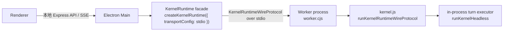

# 桌面端新内核 Worker 接入执行文档

## 1. 结论

桌面端下一步不再兼容旧 SDK、旧 `session.stream()`、每 turn CLI spawn、`stream-json` 兼容层。

目标架构固定为：



关键边界：

- Electron Main 只做 host 调度、provider 选择、SSE 映射、生命周期管理。
- Worker 是常驻 kernel runtime 进程，不随单个 turn 退出。
- Worker 内部只 import `kernel.js`，启动 `runKernelRuntimeWireProtocol()`。
- turn 执行不再 spawn `cli-bun.js`，而是 Worker 内进程内调用 `runKernelHeadless`。
- Main 和 Worker 之间只走 `KernelRuntimeWireProtocol`，不定义桌面私有 runtime 协议。
- 所有 provider/model/auth 选择必须随 conversation 或 turn 进入 kernel contract，不能依赖 Worker spawn env 作为唯一 provider 来源。

## 2. 当前基线

本执行文档以 `claude-code` commit `eeb0cb3 feat(kernel): 补齐 provider override contract` 为前置基线。

截至 2026 年 4 月 30 日，当前工作区中的 `claude-code` 已补齐 provider override contract，并已在 package-level `kernel.js` public surface 暴露 `createKernelRuntimeInProcessTurnExecutor()`；`hare-code-desktop` 主路径已经切到 worker/runtime，`electron/worker.cjs` 不再保留兼容 fallback。另一个已确认的打包面要求是：同步 vendor `kernel.js` 时，还要同步它的 runtime package dependencies 到 `electron/vendor/hare-code-kernel/node_modules`，否则 Node/Electron Main 在 release / vendor 路径下无法稳定 import `kernel.js`。

### 2.1 状态快照

- 已完成前置：
  - `claude-code` 已补齐 provider override contract。
  - `claude-code` 已补齐 `createKernelRuntimeInProcessTurnExecutor()` public export。
  - `hare-code-desktop` 已新增 `electron/worker.cjs`。
  - `hare-code-desktop/electron/main.cjs` 已切到 stdio `KernelRuntime` singleton。
  - `/api/chat` 已统一收口到 `kernelConversation.runTurn()`。
  - 旧 `runViaOpenAI()` 与桌面侧 CLI args/env helper 已删除。
  - `electron/worker.cjs` 已只走 public in-process executor，不再保留 headless CLI fallback。
  - `scripts/sync-hare-sdk.cjs` 已同步 vendor `dist`，并补齐 vendor runtime `node_modules`（当前实测至少包含 `ws`）。
- 仍待完成：
  - 仍需补跑完整 Desktop build / 桌面手测。
  - 当前本机 `bun run build` 仍因 `vite` 缺失失败，需要单独补环境或改用项目既有安装方式验证。

已经具备的 kernel contract：

- `RuntimeProviderSelection`
- `KernelRuntimeCapabilityIntent.provider`
- `create_conversation.provider`
- `run_turn.providerOverride`
- `KernelRuntimeWireTurnExecutionContext.providerSelection`
- provider 解析顺序：`providerOverride > conversation provider > runtime default`

当前剩余工作：

- 补跑 Desktop UI 手测，确认多轮对话、stop / reconnect / delete 在真实界面上的行为。
- 在本机补齐 `vite` 相关环境后重跑 Desktop build。
- 如后续需要 release 路径验证，确认 `electron-builder` 打包结果包含 `worker.cjs`、vendor `dist` 与 vendor `node_modules`。

## 3. 非目标

本阶段不做这些事：

- 不保留 `createHeadlessChatSession()` / `session.stream()` 旧 SDK 兼容层。
- 不再使用 `resolveCoworkCliEntry()`、`buildCoworkCliArgs()`、`buildCoworkCliEnv()`。
- 不在每个 turn 上 spawn `cli-bun.js`。
- 不把 OpenAI-compatible 请求绕过 kernel 继续走 `runViaOpenAI()`。
- 不新增桌面端私有 wire schema。
- 不把 provider 切换写进 Worker 进程 env 并作为唯一来源。
- 不让 Renderer 直接知道 kernel wire protocol。

## 4. 进程与对象模型

### 4.1 Worker 粒度

第一版使用一个常驻 Worker 承载一个 `KernelRuntime`。

这个 Worker 可以管理多个 conversation；conversation 隔离由 `KernelRuntime` 内部负责。不要回到“每 turn 一个 CLI 子进程”的模式。

如果后续发现某些 headless 全局状态仍不能被 runtime 隔离，再按 workspace 或 conversation 拆 Worker；这属于后续隔离策略，不改变 Main/Worker 的协议。

### 4.2 Electron Main 职责

Electron Main 保留现有 HTTP API 和 SSE 输出形态：

- `POST /api/chat`
- `POST /api/conversations/:id/stop-generation`
- `GET /api/conversations/:id/stream-status`
- `GET /api/conversations/:id/reconnect`
- `DELETE /api/conversations/:id`

Main 内部新增两个概念：

- `kernelRuntime`: 通过 `createKernelRuntime({ transportConfig })` 创建的 runtime facade。
- `activeRuns`: 只保留当前 turn 的 SSE buffer、emitter、stop handle、fullText，不再保存旧 SDK session。

### 4.3 Worker 职责

Worker 文件建议为：

- `electron/worker.cjs`

Worker 只做三件事：

1. resolve 并 import `kernel.js`。
2. 优先创建 in-process turn executor；若当前本地 package export 缺失，则临时回退到兼容 headless CLI executor。
3. 启动 `runKernelRuntimeWireProtocol()`。

示意代码：

```js
const { pathToFileURL } = require('url');

const kernelEntry = process.env.HARE_DESKTOP_KERNEL_ENTRY;
if (!kernelEntry) {
  throw new Error('HARE_DESKTOP_KERNEL_ENTRY is required');
}

(async () => {
  const kernel = await import(pathToFileURL(kernelEntry).href);
  await kernel.runKernelRuntimeWireProtocol({
    runTurnExecutor: kernel.createKernelRuntimeInProcessTurnExecutor(),
    eventJournalPath: false,
    conversationJournalPath: false,
  });
})().catch(error => {
  console.error(error?.stack || error?.message || String(error));
  process.exit(1);
});
```

注意：`eventJournalPath: false` 和 `conversationJournalPath: false` 是桌面本地 first-pass 默认值，避免 provider/auth 相关 metadata 被误写入持久 journal。后续如果要开 journal，必须先确认 provider secret 不会进入 snapshot/event payload。

## 5. Provider Contract

桌面端是多 provider，不允许只靠 Worker 进程 env。

桌面 provider state 必须在每次创建 conversation 或运行 turn 时映射成 `RuntimeProviderSelection`：

```ts
type RuntimeProviderSelection = {
  providerId: string
  kind?: 'anthropic' | 'bedrock' | 'vertex' | 'foundry' | 'openai-compatible' | 'custom'
  model?: string
  baseURL?: string
  authRef?: string | {
    type: 'env' | 'secret' | 'desktop' | 'keychain'
    id?: string
    name?: string
    service?: string
    account?: string
  }
  headers?: Record<string, string>
  secretHeadersRef?: string | {
    type: 'env' | 'secret' | 'desktop'
    id?: string
    name?: string
  }
  options?: Record<string, unknown>
  metadata?: Record<string, unknown>
}
```

桌面映射规则：

```js
function toRuntimeProviderSelection(provider, modelId) {
  const format = provider?.format || inferFormat(provider?.baseUrl, modelId);
  return {
    providerId: provider.id,
    kind: format === 'openai' ? 'openai-compatible' : 'anthropic',
    model: modelId || provider.model,
    baseURL: provider.baseUrl || undefined,
    authRef: { type: 'desktop', id: provider.id },
    metadata: {
      desktopProviderName: provider.name || provider.id,
      desktopFormat: format,
      supportsWebSearch: Boolean(provider.supportsWebSearch),
      webSearchStrategy: provider.webSearchStrategy || null,
    },
  };
}
```

执行策略：

- 第一次 lazy create conversation 时传 `provider`。
- 每次 `runTurn()` 时也传 `providerOverride`，确保用户切换 model/provider 后当前 turn 使用最新选择。
- `init_runtime.defaultProvider` 只作为兜底，不作为桌面多 provider 的主路径。
- 不把 provider 切换写成 `OPENAI_COMPAT_*` / `ANTHROPIC_*` Worker 全局 env。

Auth 处理规则：

- `authRef` 默认用 `{ type: 'desktop', id: provider.id }`，表示这是 desktop provider secret。
- Worker/in-process executor 必须通过 kernel provider resolver 消费 `authRef`，不要把 raw apiKey 写进 conversation snapshot。
- 如果短期必须把 secret 传给 Worker，只能作为本地临时 secret channel，并且必须关闭 journal、禁止进入 ack/event payload、禁止写 debug log。
- 最终状态应由 kernel 消费 `RuntimeProviderSelection`，在 provider resolver 内按 `authRef` 取真实凭证。

## 6. Electron Main 改造步骤

### Step 1: 删除旧执行路径

从 `electron/main.cjs` 移除或停止使用：

- `resolveCoworkCliEntry()`
- `buildCoworkCliArgs()`
- `buildCoworkCliEnv()`
- `runViaOpenAI()`
- 当前 `runViaKernel()` 内的 `headlessExecutor: { spawn bun cli-bun.js }`

保留：

- `resolveKernelModuleEntry()`
- `loadHareKernelModule()`
- provider CRUD
- conversation CRUD
- upload/context/project API
- SSE buffer/reconnect API

### Step 2: 新增 runtime singleton

Electron Main 增加：

```js
let kernelRuntimePromise = null;

async function getKernelRuntime() {
  if (kernelRuntimePromise) return kernelRuntimePromise;
  kernelRuntimePromise = (async () => {
    const kernel = await loadHareKernelModule();
    return kernel.createKernelRuntime({
      transportConfig: {
        kind: 'stdio',
        command: process.env.BUN_BINARY || 'bun',
        args: [path.join(__dirname, 'worker.cjs')],
        env: {
          ...process.env,
          HARE_DESKTOP_KERNEL_ENTRY: resolveKernelModuleEntry(),
        },
      },
      autoStart: true,
    });
  })();
  return kernelRuntimePromise;
}
```

Main 可以 import `kernel.js` 来创建 facade/client；Main 不能在自己进程内执行 headless turn。

### Step 3: 新增 conversation facade registry

Main 需要缓存 runtime conversation facade：

```js
const kernelConversations = new Map();

async function getKernelConversation(conversation, providerSelection) {
  const existing = kernelConversations.get(conversation.id);
  if (existing) return existing;

  const runtime = await getKernelRuntime();
  const kernelConversation = await runtime.createConversation({
    id: conversation.id,
    workspacePath: conversation.workspace_path || currentWorkspace,
    sessionId: conversation.backend_session_id || undefined,
    provider: providerSelection,
    capabilityIntent: {
      provider: providerSelection,
      tools: true,
      mcp: true,
      hooks: true,
      skills: true,
      plugins: true,
      agents: true,
      tasks: true,
      companion: true,
      kairos: true,
      memory: true,
      sessions: true,
    },
    metadata: {
      source: 'hare-code-desktop',
      sessionKind: normalizeSessionKind(conversation.session_kind),
    },
  });

  kernelConversations.set(conversation.id, kernelConversation);
  return kernelConversation;
}
```

如果 `providerSelection` 后续变化，不重新 `createConversation()`；当前 turn 使用 `providerOverride`。

### Step 4: 重写 `POST /api/chat`

请求入口保持不变，但执行路径统一变为：

1. `resolveProvider(conversation, req.body)`。
2. `toRuntimeProviderSelection(provider, stripThinking(conversation.model))`。
3. `getKernelConversation(conversation, providerSelection)`。
4. `kernelConversation.runTurn(prompt, { turnId, attachments, providerOverride: providerSelection, metadata })`。
5. 从 runtime event stream 映射 SSE。
6. terminal 后保存 assistant message。

不再按 `provider.format === 'openai'` 分叉到 `runViaOpenAI()`。

### Step 5: stop / delete / reconnect

`activeRuns` 的 stop handle 改为：

```js
stop: () => {
  void kernelConversation.abortTurn(turnId, {
    reason: 'desktop_stop_generation',
  }).catch(() => {});
}
```

删除 conversation 时：

1. stop 当前 active turn。
2. `kernelConversations.get(id)?.dispose('desktop_conversation_deleted')`。
3. `kernelConversations.delete(id)`。
4. 删除本地 state。

reconnect 仍然只 replay `activeRuns.get(id).buffer`，不要求 Renderer 读 kernel replay event。

## 7. Event 到 SSE 映射

Renderer 暂时不改，所以 Main 继续输出现有 SSE payload：

- 文本 delta：

```json
{ "type": "content_block_delta", "delta": { "type": "text_delta", "text": "..." } }
```

- 正常结束：

```json
{ "type": "message_stop" }
```

- 错误：

```json
{ "type": "error", "error": "..." }
```

- stream 结束：

```text
[DONE]
```

Main 的 mapper 只消费 public `KernelEvent` / `KernelRuntimeEnvelope`：

- `turn.output_delta` 或 headless text delta -> `content_block_delta`
- `turn.completed` -> `message_stop` + `[DONE]`
- `turn.failed` -> `error` + `[DONE]`
- `turn.abort_requested` / abort terminal -> `error: "Task stopped."` + `[DONE]`
- tool/hook/permission/task/plugin/agent events 第一阶段可以记录到 debug log 或转成非文本 UI 事件，但不能混入 assistant 文本。

## 8. 文件改动清单

### 必改

- `electron/worker.cjs`
  - 新增 Worker runner。
  - import `kernel.js`。
  - 调 `runKernelRuntimeWireProtocol()`。
  - 注入 `createKernelRuntimeInProcessTurnExecutor()`。

- `electron/main.cjs`
  - 删除 CLI spawn turn path。
  - 删除 OpenAI direct bypass path。
  - 新增 `getKernelRuntime()`。
  - 新增 `kernelConversations` registry。
  - 新增 `toRuntimeProviderSelection()`。
  - 改造 `/api/chat`、stop、delete。

### 视情况改

- `scripts/sync-hare-sdk.cjs`
  - 当前脚本已同步整套 `dist` 到 `electron/vendor/hare-code-kernel/dist`。
  - 当前脚本还需要同步 vendor runtime package dependencies 到 `electron/vendor/hare-code-kernel/node_modules`，否则 Node / Electron Main 在 vendor 路径下无法稳定 import `kernel.js`。
  - 如果 `worker.cjs` 需要随发布打包，确认 electron-builder 包含它、vendor dist 与 vendor `node_modules`。

- `README.md`
  - 更新本地开发说明：桌面端运行依赖 `kernel.js` + `worker.cjs`，不再依赖旧 SDK bundle。

- `package.json`
  - 如果新增 smoke/test script，可加入 `kernel:smoke` 或 `electron:smoke`。

## 9. 验证计划

### Kernel 前置验证

当前工作区默认视为这组前置已经完成；如果后续继续改 `claude-code` 的 executor、wire surface 或 package export，仍然要回归这组验证。

在 `../claude-code`：

```bash
bun test src/runtime/core/wire/__tests__/KernelRuntimeWireRouter.test.ts src/kernel/__tests__/packageEntry.test.ts
bun run typecheck
bun test src/kernel/__tests__/surface.test.ts tests/integration/kernel-package-smoke.test.ts
```

### Desktop 构建验证

在 `hare-code-desktop`：

```bash
bun run kernel:build
bun run build
node -c electron/main.cjs
node -c electron/worker.cjs
```

建议增加的 smoke：

```bash
# 1. Node 直接 import vendor kernel.js，确认 packaged / vendor 路径可解析
# 2. createKernelRuntime({ transportConfig: stdio }) -> createConversation() -> dispose()
# 3. 本地失败 provider turn smoke，确认 turn 能返回终态，不会卡死在 worker 内
```

### Worker smoke

最小 smoke：

1. 启动 Worker。
2. 发送 `ping`，收到 `pong`。
3. 发送 `init_runtime`。
4. 发送 `create_conversation`，带 `provider`。
5. 发送 `run_turn`，带 `providerOverride`。
6. 收到 text delta 和 terminal event。
7. 发送 `abort_turn`，确认只 abort 当前 turn。
8. 发送 `dispose_conversation`。

### Desktop 手测

- Anthropic provider 发起一轮普通 chat。
- OpenAI-compatible provider 发起一轮普通 chat。
- 同一个 app 里两个 conversation 使用不同 provider，确认不会互相污染。
- 生成中 stop，只停止当前 conversation。
- 生成中刷新/重连，确认 `/reconnect` 能 replay 已缓存 SSE。
- 删除 conversation，确认 Worker/runtime conversation 被 dispose。
- 触发 permission request 时，未接 UI 前必须显式失败或走 broker，不能静默通过。
- Worker crash 后下一轮请求能返回明确错误或重建 Worker，不能静默卡住。

## 10. 验收标准

代码层：

- `electron/main.cjs` 不再出现 `resolveCoworkCliEntry()`。
- `electron/main.cjs` 不再出现 `buildCoworkCliArgs()`。
- `electron/main.cjs` 不再出现 `buildCoworkCliEnv()`。
- `electron/main.cjs` 不再 spawn `cli-bun.js` 做 turn。
- `/api/chat` 不再绕过 kernel 直接请求 OpenAI-compatible HTTP。
- Worker 只 import package-level `kernel.js`，不 import `claude-code/src/*`。
- Main/Worker 通信只使用 `KernelRuntimeWireProtocol`。

行为层：

- 每个 turn 不再产生 CLI 子进程。
- Worker 常驻，多个 turn 复用同一个 runtime。
- provider 可按 conversation 或 turn 变化。
- OpenAI-compatible、Anthropic-compatible 都走 kernel provider contract。
- stop/delete/reconnect 保持当前前端 API 行为。

安全层：

- provider auth 不写入 Worker 全局 env 作为切换机制。
- provider secret 不进入 long-lived journal、debug log、conversation snapshot。
- permission request 不能静默通过；未接 UI 前必须显式失败或走 broker。

## 11. 执行顺序

1. 确认 `hare-code-desktop` 当前使用的 `kernel.js` 来源，并在需要时执行 `bun run kernel:build` 同步 vendor dist 与 vendor runtime deps。
2. 已完成：新增 `electron/worker.cjs`。
3. 已完成：在 `electron/main.cjs` 接入 stdio `KernelRuntime` singleton。
4. 已完成：在 `electron/main.cjs` 增加 `kernelConversations` registry 与 desktop provider -> `RuntimeProviderSelection` mapper。
5. 已完成：改造 `/api/chat` 到统一 `kernelConversation.runTurn()`，并为每 turn 传 `providerOverride`。
6. 已完成：改造 stop/delete/reconnect 到 runtime conversation 生命周期。
7. 已完成：删除旧 CLI/OpenAI direct path。
8. 已完成：`claude-code` package export 与 `electron/worker.cjs` 已去掉兼容 fallback。
9. 剩余：跑 Desktop build、Worker smoke、Desktop 手测；如本轮改动继续波及 `claude-code`，再补跑 Kernel 前置验证。

## 12. 当前下一刀

下一刀不是改 Renderer，也不是补旧 SDK adapter。

下一刀是：

1. `hare-code-desktop`: 在本机补齐 `vite` 相关环境，跑通 `bun run build`。
2. `hare-code-desktop`: 做桌面 UI 手测，确认多轮 turn、stop-generation、reconnect、delete 会话都还正常。
3. 若要做 release 验证：检查 electron-builder 产物中 `worker.cjs`、vendor `dist`、vendor `node_modules` 是否完整带上。

